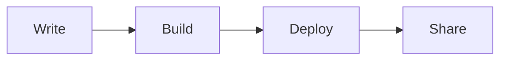

Welcome to your new blog! This is a sample post to help you get started.

## Features

This blog template comes with everything you need:

- **Bilingual support** — English and Chinese out of the box
- **Dark mode** — Automatic theme switching with user preference
- **Full-text search** — Powered by Pagefind
- **Math rendering** — $E = mc^2$ with KaTeX
- **Diagrams** — Mermaid with hand-drawn style
- **Comments** — Giscus integration
- **RSS feeds** — For both languages

## Getting Started

Edit this file at `src/content/post/en/hello-world.md` to replace it with your own content, or delete it and create new posts.

### Code Example

```typescript
const greeting = "Hello, World!";
console.log(greeting);
```

### Diagram Example



## What's Next

1. Update `site.config.ts` with your site info
2. Replace the avatar in `public/avatar.png`
3. Start writing your posts in `src/content/post/en/` and `src/content/post/zh/`
4. Deploy to Vercel, Netlify, or any static hosting
