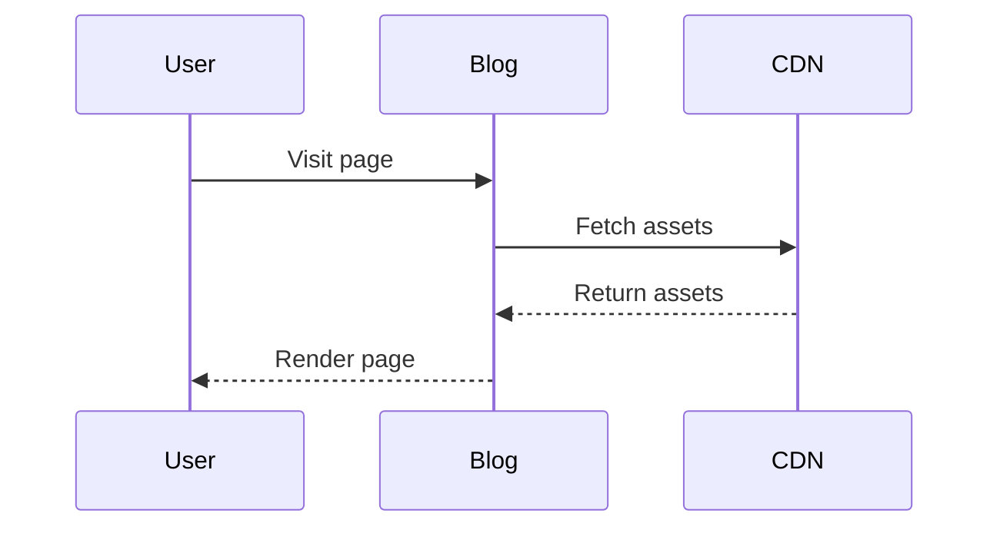

This post demonstrates all the Markdown features supported by this blog template.

## Text Formatting

**Bold text**, *italic text*, and ~~strikethrough text~~.

## Blockquotes

> The best way to predict the future is to invent it. — Alan Kay

## Lists

### Unordered

- First item
- Second item
  - Nested item
  - Another nested item
- Third item

### Ordered

1. First step
2. Second step
3. Third step

## Code Blocks

Inline code: `const x = 42;`

```javascript
function fibonacci(n) {
  if (n <= 1) return n;
  return fibonacci(n - 1) + fibonacci(n - 2);
}
```

## Tables

| Feature | Status |
| --- | --- |
| Dark Mode | Supported |
| i18n | EN / ZH |
| Search | Pagefind |
| Comments | Giscus |

## Math

Inline math: $a^2 + b^2 = c^2$

Block math:

$$
\int_{-\infty}^{\infty} e^{-x^2} dx = \sqrt{\pi}
$$

## Diagrams



## Container Blocks

:::tip
This is a tip block for helpful information.
:::

:::warning
This is a warning block for important notices.
:::
