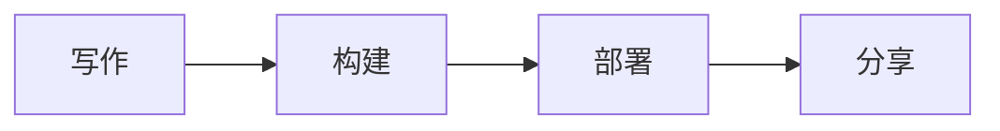

欢迎来到你的新博客！这是一篇示例文章，帮助你快速上手。

## 功能特性

这个博客模版内置了你所需的一切：

- **双语支持** — 英文和中文开箱即用
- **暗色模式** — 自动主题切换，支持用户偏好
- **全文搜索** — 基于 Pagefind
- **数学公式** — $E = mc^2$，使用 KaTeX 渲染
- **图表** — Mermaid 手绘风格
- **评论系统** — Giscus 集成
- **RSS 订阅** — 支持两种语言

## 开始使用

编辑 `src/content/post/zh/hello-world.md` 来替换这篇文章，或者删除它并创建新的文章。

### 代码示例

```typescript
const greeting = "你好，世界！";
console.log(greeting);
```

### 图表示例



## 下一步

1. 修改 `site.config.ts` 中的站点信息
2. 替换 `public/avatar.png` 中的头像
3. 在 `src/content/post/en/` 和 `src/content/post/zh/` 中开始写作
4. 部署到 Vercel、Netlify 或任何静态托管
