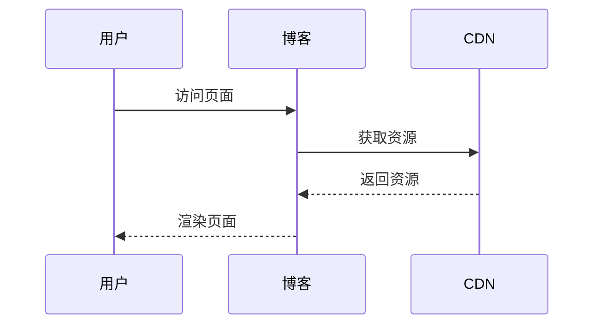

这篇文章展示了此博客模版支持的所有 Markdown 功能。

## 文本格式

**粗体文本**、*斜体文本*、~~删除线文本~~。

## 引用

> 预测未来的最好方式就是创造它。—— 艾伦·凯

## 列表

### 无序列表

- 第一项
- 第二项
  - 嵌套项目
  - 另一个嵌套项目
- 第三项

### 有序列表

1. 第一步
2. 第二步
3. 第三步

## 代码块

行内代码：`const x = 42;`

```javascript
function fibonacci(n) {
  if (n <= 1) return n;
  return fibonacci(n - 1) + fibonacci(n - 2);
}
```

## 表格

| 功能 | 状态 |
| --- | --- |
| 暗色模式 | 已支持 |
| 国际化 | 中文 / 英文 |
| 搜索 | Pagefind |
| 评论 | Giscus |

## 数学公式

行内公式：$a^2 + b^2 = c^2$

块级公式：

$$
\int_{-\infty}^{\infty} e^{-x^2} dx = \sqrt{\pi}
$$

## 图表



## 容器块

:::tip
这是一个提示块，用于展示有用的信息。
:::

:::warning
这是一个警告块，用于展示重要的提醒。
:::
